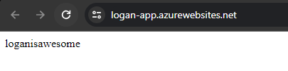
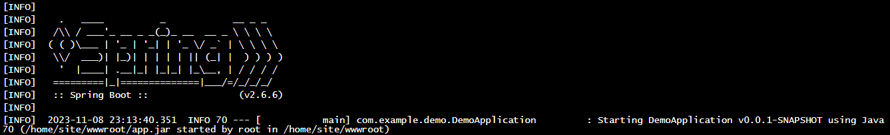
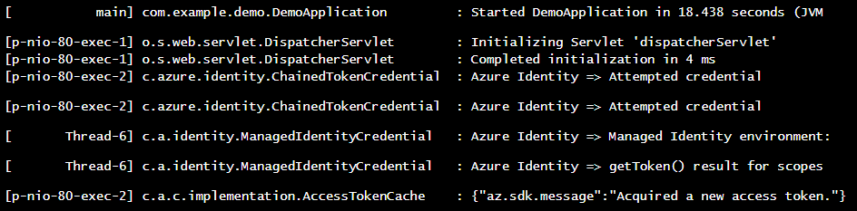

# App Service - Keyvault Demo
A simple working keyvault example setup for debugging more complex infrastructure issues.

## Version Info

- Java **17** (App Service runtime is also set to Java 17)
- Spring **2.6.6**
- spring-cloud-azure-dependencies **4.13.0**
- spring-cloud-azure-starter-keyvault **4.12.0** (Because 4.13.0 was not found in maven central for whatever reason)

## Setup Steps

- Create both an app service and keyvault in azure cloud.
- Create a new secret in the keyvault (the key must match exactly as shown):  
  **key:** example-secret  
  **value:** loganisawesome
- Enable the system managed identity for the app service.
- Give the system managed identity a role of secrets officer on the keyvault.
- Add a KEY_VAULT_URI environment variable in the app service app settings. 
  - E.g. `https://logan-kv.vault.azure.net/`
- Jar deploy the app service (Steps below).

Hit the app service endpoint and you should see **loganisawesome**

## Compiling the program

Pretty straight forward...  
`mvn package`

## Deploying the jar

Open a terminal in the target folder and run (substituting your values)...  
`az webapp deploy --resource-group ResourceGroup --name AppName --src-path ./demo-0.0.1-SNAPSHOT.jar --type jar --clean true`

## After deploying

### Hit the app service endpoint

### The startup in the kudu console

There should be lots of startup text after the above.

### Managed identity token acquisition (after hitting the endpoint)
